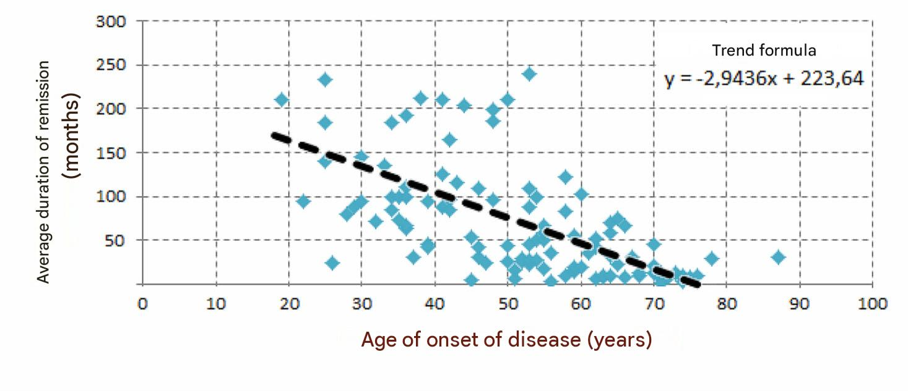
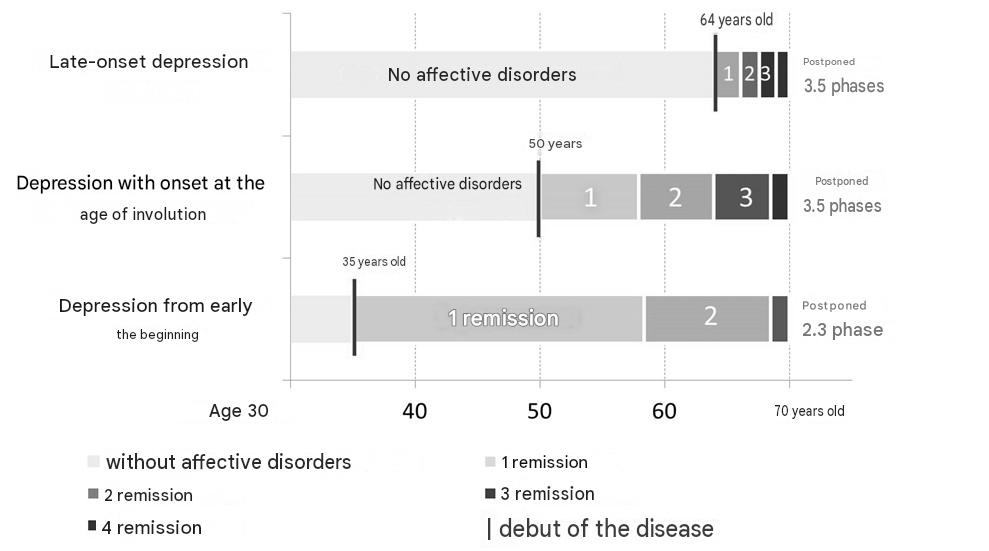

# Clinical and dynamic characteristics of recurrent depressive disorder in late life

Author: Zakharchenko Denis Valerievich

Specialty: 14.01.06 – psychiatry

Abstract of the dissertation for the academic degree of Candidate of Medical Sciences

City of St. Petersburg, 2015

The work was performed at the V.M. Bekhterev St. Petersburg Scientific Research Psychoneurological Institute

Scientific supervisor: Doctor of Medical Sciences, Professor Neznanov Nikolay Grigoryevich

Official opponents:

- Petrova Nataliya Nikolaevna, Doctor of Medical Sciences, Professor, Head of the Department of Psychiatry and Narcology of St. Petersburg State University,

- Babin Sergey Mikhailovich, Doctor of Medical Sciences, Professor, Head of the Department of Psychotherapy and Sexology of the I.I. Mechnikov North-Western State Medical University

Leading organization: St. Petersburg State Pediatric Medical University

The defense will take place on March 26, 2015, at 14:00 at the meeting of the dissertation council D 208.093.01 for the defense of doctoral and candidate dissertations at the V.M. Bekhterev St. Petersburg Scientific Research Psychoneurological Institute (192019, St. Petersburg, Bekhtereva St., 3)

The dissertation can be read in the institute's library and on the institute's website at: [http://bekhterev.ru](http://bekhterev.ru)

The abstract was sent out on February 26, 2015.

Scientific Secretary of the Dissertation Council, Doctor of Medical Sciences, Professor Chekhlaty Evgeny Ivanovich

## GENERAL CHARACTERISTICS OF THE WORK

**_Relevance of the research._** The problem of depression in the elderly becomes increasingly important every year. This is due both to the higher prevalence of depressive disorders in individuals in the involutional period compared to young people (Kanowski S., 1994; Kessler R.C., 2010), and to the trend towards an increase in the proportion of the elderly in society (Lutz W., 2008). It has been shown that in old age there are a number of factors predisposing to the appearance of depression, however, the contribution of each of them to the development of affective pathology remains a subject of discussion (Smulevich A.B., 2001; Kruglov L.S., 2011; Neznanov N.G., 2012; Alexopolos G.S., 2009; Wilkins V.M., 2010). In this regard, the decline in the quality of life of older people was considered, caused not only by a decrease in their material wealth due to retirement and reduced financial security, but also by the aggravation of the course of existing somatic diseases in this age period, which generally contributes to an increase in the level of suicide risk (Alexopoulos G.S., 2005; Blazer D.G., 2009).

Previous studies have found the specificity of the psychopathological structure of depression in the elderly and the features of its dynamics during the aging process (Efimenko M.L., 1975; Sternberg E.Ya., 1977; Vertogradova O.P., 1986; Kontsevoy V.A., 1997), however, their results turned out to be largely contradictory. Thus, most studies showed prognostically unfavorable features of depression and its dynamics in late life: increased frequency, aggravation and atypicality of phasic fluctuations, predominance of anxious affect, the addition of delusional disorders and intellectual decline, high comorbidity with somatic diseases (Efimenko V.L., 1975; Mineev A.N., 1983). At the same time, other authors noted that in a number of cases, the features and dynamics of late-life depression are characterized by a decrease in the amplitude of mood fluctuations, simplification and typification of syndromal manifestations, an increase in the proportion of incomplete states and a predominance of affective disorders of a neurotic level (Sudareva L.O., 1983; Vertogradova O.P., 1986; Vorobyova O.V., 2004).

A pressing issue in psychiatry is the typification of depression, both in general and particularly in late life. At the moment, there is no general classification of depressive disorders, but only various methods for dividing depressions into subtypes, within which some features are emphasized as system-forming, then others (Petrova N.N., 1996; Tiganov A.S., 1999; Smulevich A.B., 2013; Harald B., 2012), which complicates the possibility of comparing the results of different studies with each other.

Also ambiguous remains the assessment of the possibilities of antidepressant therapy in gerontopsychiatric practice. Numerous studies comparing the effectiveness of treating depression in elderly and middle-aged patients did not allow reaching a common point of view regarding the severity of differences in therapeutic approaches between these groups, since the results of these works differed significantly among different researchers (Babin S.M., 1996; Andrusenko M.P., 2004; Hughes D.C., 1993; Fischer L.R., 2003). At the same time, most studies compared only the response to therapy of elderly and middle-aged patients, without taking into account the influence of the clinical picture and the characteristics of the course of the recurrent affective disease.

Thus, the existing discrepancy in the assessments of late-life depression indicates an insufficient understanding of this type of pathology. The presence of significant contradictions leads to the need for a comprehensive analysis of the course of recurrent depressive disorder, with an assessment of the relationship between various components of psychopathological disorders, the dynamics of syndromal manifestations and the nature of the response to treatment. Conducting such an analysis will allow us to approach an answer to the question of what recurrent depression in late life is, what factors determine its course and which of them can influence the effectiveness of antidepressant therapy.

In connection with the above, the main goal and objectives of this study were identified.

The aim of the research: to increase the possibility of timely detection of recurrent depressive disorder in the elderly and clarify the features of its clinical picture and therapy at various stages of the disease's course

### Objectives of the research

1. To investigate the clinical and dynamic characteristics of recurrent depressive disorder in elderly patients: clinical features of psychopathological manifestations (taking into account the differences in the ratios of their structural components), the nature of the course (taking into account the duration and frequency of phases), the quality of remissions.

2. To determine the main factors influencing the nature of the course of late-life depressions.

3. To evaluate the nature of somatic burden and the level of neuroticism in patients with depression in late life.

4. To study the effectiveness of antidepressant therapy at various stages of the course of recurrent depression.

**_Scientific novelty_**. For the first time, a comprehensive assessment of the course of recurrent depression in elderly people who fell ill in different periods of their lives was performed.

A characteristic of the clinical symptoms of late-life depression at different stages of the disease's course is given, and clarifying data on a high level of neuroticism and concomitant somatic pathology in patients of the study group were obtained.

For the first time, using the example of the Russian population, recurrent depressive disorder was considered throughout the entire disease. The increase in frequency and severity of depressive phases without a change in their duration, the reduction and deterioration of the quality of remissions, changes in the syndromal manifestations of affective disorder, the relationship of exacerbations with various external factors were traced, and the dynamics of psychopharmacotherapy received by patients in late life were evaluated.

The typification of clinical manifestations of depression was carried out, and the relationship of the dynamics of affective symptoms with the age of its onset was shown – a factor previously practically not considered in the works of domestic authors. For the first time, it was shown that patients who fell ill in different age periods significantly differ in the duration of remissions, the overall severity and structure of the depressive syndrome, the degree of influence of external factors on the frequency of exacerbations, and the nature of the response to antidepressant therapy.

It was found that the differences in the manifestations of depressive symptoms in patients who fell ill in different age periods decrease as patients reach old age.

The relationships of the features of the subjective experiences of the state of depression in old age with its objectively observed signs were studied in detail, and a high level of patients' awareness of their affective disease was reflected.

### Practical significance of the work. Based on the results of the study, signs were identified that allow predicting the nature of the further course of affective disease and the effectiveness of antidepressant therapy in patients suffering from recurrent depression in old age

It was found that the nature of the course of the affective disorder, its clinical manifestations and the degree of response to antidepressant therapy are associated with the duration of the disease and the age of the onset of depressive symptoms. It was revealed that depression with late onset is the most unfavorable type of late-life depression and is characterized by a tendency to a protracted course, short incomplete remissions, as well as a relatively low response to pharmacotherapy. On the contrary, early-onset depression (before 45 years) is relatively favorable in terms of the overall prognosis of the disease, and depression with an onset in the involutional age (45-55 years) - in terms of better response to antidepressant therapy. Consideration of these data can be useful for planning pharmacotherapy and assessing the prognosis of the disease in elderly patients with depression.

### Main provisions to be defended

1. **Depressions in late life are generally characterized by an unfavorable course, an increase in the frequency and severity of depressive episodes, a reduction in the duration and deterioration in the quality of remissions.**

2. **The age of depression onset is a significant diagnostic factor that affects its clinical picture and features of recurrence. An increase in the age of onset of an affective illness worsens its course and makes the prognosis more unfavorable.**

3. Among elderly patients with recurrent depressive disorder, three main groups can be distinguished (depression with early onset, late onset, and onset in the involution age), differing in the nature of the course of the affective disease and its clinical manifestations, but not differing in gender-age composition, individual-typological characteristics, and the level of concomitant somatic pathology.

4. With the onset of depression in the involutional age (45-55 years), patients were characterized by a better response to antidepressant therapy in the subsequent stages of the disease than patients with the onset of a mental disorder outside this time period.

### Approbation and implementation of the research results.

14 works have been published on the topic of the dissertation in specialized scientific journals, of which 4 are in journals recommended by the Higher Attestation Commission for the publication of materials of candidate dissertations. The results of the work were reported at the St. Petersburg scientific-practical School of Young Scientists within the "Bekhterev Readings" cycle (2010, 2012), the Scientific-practical conference for the 110th anniversary of the Department of Psychiatry and Narcology of the I.P. Pavlov St. Petersburg State Medical University (2010), the Second All-Russian Conference with international participation "Cognitive and other neuropsychiatric disorders" (2011), the All-Russian anniversary scientific-practical conference "Current problems of military psychiatry" (2011), the All-Russian scientific-practical conference with international participation "Translational medicine – an innovative path of development of modern psychiatry" (2013), and the International Congress "Mental Health in Russia and Germany" (2014). The work was awarded an incentive prize at the Russian scientific conference with international participation "Psychiatry: paths to mastery" (2013). The results of the work were implemented in the work of the Department of Geriatric Psychiatry of the V.M. Bekhterev NIPNI and in the educational program of the training center.

### Scope and structure of the work.

The material of the dissertation is set out on 239 pages of typewritten text. The work contains an introduction, five chapters, conclusions, and a list of references. The dissertation is illustrated with 44 tables and 32 diagrams. The list of references includes 483 titles, including 116 domestic and 367 foreign sources.

## Content of the work

### Material and methods of research.

The study, conducted at the geriatric psychiatry department of the V.M. Bekhterev SPb NIPNI, included 110 patients of both sexes who applied for inpatient or outpatient care using a continuous sampling method.

_Inclusion criteria_ for the group of subjects were the following signs:

1. Age over 50 years.

2. Correspondence of the clinical state and course of the disease to the criteria for the diagnosis of "Recurrent depressive disorder" (F33) ICD-10 (WHO, 1994).

3. At least two depressive phases in the anamnesis.

_Exclusion criteria_ from the study were the following signs:

1. The presence of criteria for other comorbid mental disorders.

2. Abuse of psychoactive substances and alcohol.

3. Severe somatic pathology in the decompensation stage.

4. Dementia comorbid with depression.

The sample of 110 patients included 9 men (8.2%) and 101 women (91.8%), of which 103 people (83.6% of those examined) were hospitalized in the Department of Geriatric Psychiatry of the V.M. Bekhterev NIPNI. The average age of the subjects was 70.2 ± 8.0 years. The average period of medical observation during the current depressive phase was 5.0 ± 2.0 weeks.

The main research methods were clinical and psychological. Diagnosis of mental illness was carried out on the basis of a thorough clinical and psychopathological assessment of the patient's condition, taking into account heredity, individual development, previous illnesses, premorbid personality traits, the first manifestations and subsequent dynamics of mental disorders. For diagnostic verification of concomitant somatoneurological diseases, specialists from the respective profiles were involved, and auxiliary paraclinical (instrumental and laboratory) methods were used.

The type of depression was assessed based on clinical data taking into account the Hamilton rating scale. Depending on the nature of the affective pathology defining the patient's clinical state, the existing disorders were attributed to melancholic, anxious, apathetic, asthenic depression, or depression with symptoms of depersonalization.

To study the structure and dynamics of depressive disorders, as well as to investigate the subjective perception of depression by older people (both within the current depressive episode and in the dynamics of the disease), a semi-structured diagnostic interview was developed. The survey results were reflected in a specially designed "Patient Examination Card" (Appendix), which contains 247 signs grouped into 10 blocks.

To objectify the information obtained during the interview, medical documents were used: case histories, outpatient clinic cards, discharge summaries from psychiatric hospitals, medical records from somatic hospitals, and conclusions based on the results of examinations from other diagnostic centers.

The patient was examined twice: the first time upon admission, and the second time - after 5-7 weeks of using antidepressant therapy in adequate doses for the condition, that is, at the stage of establishing remission. For a more complete characterization of the current episode in patients with protracted phases, the available catamnestic period was also investigated.

To objectively assess the severity of the depressive state, the Hamilton Depression Rating Scale (Hamilton M., 1960) (HAM-D21, 21 items) was used, additionally the Beck Depression Inventory (21 items) (Beck A.T., 1960) was used for self-assessment of the severity of depression. The "Mini-mental State Examination" (MMSE) and the clock-drawing test (Folstein M.F., 1975; Lovenstone S., 2001) were used as a screening tool to assess the state of cognitive functions. To assess some character traits capable of influencing the development and dynamics of depression, the Eysenck Personality Inventory (EPI) (Eysenck H.J., 1963) was applied. To assess the subjective perception of depression, a survey according to the list of depressive symptoms (Appendix) was additionally used.

**Statistical data analysis** was performed using the IBM SPSS Statistics 20.0 program - a computer program for statistical processing designed for applied research in social and medical sciences.

At the first stage, a statistical assessment of the data of the entire pool of patients was carried out. Mean values of indicators (M) and their standard deviations (DS), as well as frequency distribution were calculated. Analysis of the relationship between signs was performed using Pearson's correlation analysis (Pearson K., 1900).

To isolate groups of patients, a cluster analysis by the k-means method (MacQueen J., 1967) was performed, widely used in medicine with a large number of variables and several options for constructing the classification of the studied phenomena (Leonov V.P., 1997). After that, the entire pool of patients was re-analyzed taking into account the obtained groups. The significance of differences between groups (p) for samples with a normal distribution and homogeneity of variances was calculated based on Student's t-test. Variables belonging to interval or ordinal scales with a distribution other than normal or heterogeneity of variances were compared using nonparametric methods (Mann-Whitney U-test, Kruskal-Wallis method, to calculate the value (p) - two-sided asymptotic significance). The calculation of differences in proportions (percentages) was made by Fisher's angular transformation φ-criterion. Indicator distributions were compared using Pearson's χ2 criterion.

### MAIN RESULTS OF THE RESEARCH

**General characteristics of recurrent depressive disorder.** Analysis of the course of recurrent depressive disorder in the total sample showed that the onset of the disease occurs on average at the age of 51, the average duration of the disease was 18.4 ± 14.1 years, during which patients suffered on average 3.3 ± 2.4 depressive phases of approximately equal duration. The average duration of hypothymic episodes was 6.3 ± 5.7 months, which may indicate a tendency to a protracted course of depression, and the duration of remissions - 72.7 ± 70.6 months, or about 6 years. The number of hospitalizations in a psychiatric hospital averaged 2.0 ± 2.1 over the period of the disease, the need for inpatient treatment arose in approximately half of the transferred episodes.

In general, the study sample was characterized by a predominance of females (91.8%, 101 individuals), a significant burden of concomitant somatic pathology (4.3 ± 1.1 points according to the Charlson comorbidity index) and a high level of neuroticism (15.4 ± 4.2 points on the neuroticism scale in the Eysenck personality test). Hereditary burden of mental illness was noted in a quarter of the subjects (25.5%, 28 individuals), seasonal dependence of exacerbations – in half (56.4%, 62 patients).

Most patients were characterized by moderate depression severity (68.2%, 75 individuals), less frequently mild (12.7%, 14 individuals) or severe (19.1%, 21 individuals) depression was noted. In less than a third of the episodes, cognitive impairments (21.6%, 103 phases) or apathy (28.7%, 137 phases) were detected. As a rule, the leading component in the syndrome structure was the anxious (48.2%, 53 individuals) or anxious-melancholic component (33.6%, 37 individuals). Sleep and appetite disorders, changes in weight were observed to one degree or another in almost all cases of late-life depression. In some patients, the manifestation of the depressive syndrome was reduced and was characterized by the presence of only individual signs.

The course of late-life depressions was generally unfavorable. This manifested itself in the fact that over time, patients noted an increase in the frequency of phases (64%, 70 individuals), an increase in their severity (47%, 52 individuals), and the appearance of new (additional) symptoms. As the disease progressed in the structure of the depressive syndrome, the frequency of representation of cognitive symptoms increased (by 2.3 times), hypochondriacal experiences (by 35%), apathy (by 30%), sleep (by 26%) and appetite (by 29%) disorders, fatigue (by 15%), and diurnal mood swings (by 18%). There was a reduction in the duration of remissions (from 101.1 ± 119.5 months in the first remission to 55.3 ± 87.7 - in the last), and the proportion of incomplete remissions increased (from 45% to 66%), the residual symptoms of which were predominantly represented by episodes of hypothymia.

It was found that there is a significant inverse correlation between the age of onset of the disease and the duration of remission (R = -0.632, p < 0.01). A later onset of the affective disorder was associated with a shortening of the average duration of remissions and made its course relatively less favorable (Figure 1). At the same time, in the overwhelming number of cases, the first remission in these patients compared to the subsequent ones was the longest and averaged about 9 years (101.1 ± 119.5 months).

Figure 1 - Correlation between the age of disease onset and the average duration of remission.

Analysis of pharmacotherapy showed that in most observations, antidepressant therapy led to complete (in 53% of cases) or partial (in 41% of cases) remission, in a quarter of cases (27%) there was a need to change the drug. Untreated episodes (10.5% of all suffered phases) mostly occurred at the onset of the disease. In the current episode, patients with late-life depression also demonstrated satisfactory treatment results, 69.7% (69 people) achieved a complete remission, while the need to change the drug arose in 57.3% (63 people). It should be noted that the overall effectiveness of psychopharmacotherapy in old age differed slightly from the treatment results at a younger age, however, a more frequent change of antidepressant was required to achieve remission. We were unable to find evidence to support the assumption about the possible influence of concomitant somatic therapy on the provocation of depressive symptoms (Dhondt A.D.F., 1995). Also, we could not find any significant links between the effectiveness of antidepressant therapy and individual clinical manifestations of depression.

**The results of the study after carrying out cluster analysis**. The typologization of depressive states in old age represents a separate problem (Kornetov N.A., 1999; Blazer D.G., 2003). At the moment, there are various ways to divide depressions into subtypes, according to which certain signs are distinguished as system-forming, but a unified approach to solving this problem has not yet been developed (Tiganov A.S., 1997). To avoid subjective influence on the solution of this problem, we used a statistical method of cluster analysis, which is one of the possible ways to create an automatic classification and divide sample patients into specific groups (Leonov V.P., 1997; Sidorenko E.V., 2007).

As a result of applying cluster analysis to the common data pool, the subjects were divided into three groups (clusters). The main factors around which the clusters formed were the age of disease onset and the duration of remission. In this regard, the resulting groups were named: "early-onset depression", "depression with onset in the involution period" and "late-onset depression" (Table 1). When choosing a name for the groups, we were guided by the classification of aging periods by E.Ya. Sternberg (1967), which better reflects the clinical specificity of mental diseases of late age than the more general WHO classification of aging periods (1963).

Further statistical analysis showed significant differences between the compared groups in the nature of the course, clinical manifestations, and the effectiveness of pharmacotherapy of depressive symptoms. At the same time, the compared groups did not differ by gender, age, the severity of concomitant somatic pathology, or the level of neuroticism.

Table 1 - Main characteristics of the groups

| Conventional group designation                                                        | Late-onset depression  | Depression with onset in the involution period | Early-onset depression  |
| ------------------------------------------------------------------------------------- | ---------------------- | ---------------------------------------------- | ----------------------- |
| Cluster number                                                                        | 1                      | 2                                              | 3                       |
| Average age of disease onset                                                          | 64 years               | 50 years                                       | 35 years                |
| Number of patients and their share                                                    | 29 individuals (26.4%) | 63 individuals (57.2%)                         | 18 individuals (16.4%)  |
| The period which accounted for the disease onset (according to Sternberg E.Ya., 1967) | Late (after 55 years)  | Involutional (45-55 years)                     | Middle (up to 45 years) |
| Disease duration                                                                      | Short (7 years)        | Medium (19 years)                              | Long (35 years)         |
| Intermission duration                                                                 | Short (14 months)      | Medium (62 months)                             | Long (206 months)       |
| Number of episodes                                                                    | 3.6 episodes           | 3.6 episodes                                   | 2.3 episodes            |
| Frequency of exacerbations                                                            | Relatively high        | Relatively high                                | Relatively low          |
| Course character                                                                      | Relatively unfavorable | Moderate                                       | Relatively favorable    |

Patients with onset of depression in middle age ("early onset") had a more "endogenous" character of the disease, represented mainly by melancholic affect and vital disturbances. The course of the disease in this group was characterized by relatively rare depressive episodes like "cliché", between which the longest remissions were observed (Figure 2). The first episodes in middle age in these patients, as a rule, arose spontaneously (67.0%, 12 individuals), and exacerbation of depression in old age were more often associated with external, mainly psychotraumatic factors (55.6%, 10 individuals).

Patients with the onset of depression in late life were characterized by frequent exacerbations of mental illness, short intervals between phases, and a tendency to form incomplete remissions. The first episode of depression in the elderly, as a rule, arose in connection with a psychotraumatic situation (65.5%, 19 individuals) and was the longest (11.4 ± 14.1 months) both in comparison with subsequent episodes, and in comparison with the duration of episodes in patients of other groups. Subsequently, against the background of a high frequency of phase formation, depressive episodes increasingly relapsed spontaneously and became shorter (Figure 2). In the structure of the depressive syndrome, anxious and melancholic affect were encountered in approximately equal proportions, in some cases a predominance of apathy was noted (14.5%, 19 phases). Hypochondriacal (61%, 79 phases), senestopathic (31%, 40 phases), and cognitive impairments (30%, 39 phases) were significantly more frequent in this group.

The most interesting was the group with the onset of depression in the involution age, which accounted for more than half of the patients in the general sample (Table 1). Demonstrating average indicators regarding the duration of remissions and the frequency of exacerbations (Figure 2), such patients differed significantly from other groups in clinical terms. Thus, anxiety affect (55.9%, 160 phases) dominated in the structure of the depressive syndrome in this group, while the representation of actually depressive and vital disorders was significantly less, and therefore mainly mild depressions were observed at the beginning of the disease. In the future, the severity of affective symptoms in this group increased, and the leading affect changed from anxious to anxious-melancholic.

Figure 2 - Comparative dynamics of remission durations.

Analysis of psychopharmacological treatment of the current episode showed that patients with the onset of affective disease in the involution age respond better to antidepressant therapy than patients with early or late onset of depressive disorder (Table 2). Despite the identical severity of depression in all compared groups upon admission, after the treatment, part of the patients with early-onset depression (53%, 10 individuals) retained subdepressive symptoms. However, the worst treatment results were observed in the group of patients with late-onset depression, where, along with persisting hypothymia (65%, 19 individuals), persistent senestopathies (31%, 8 individuals), emotional lability (31%, 8 individuals), as well as signs of cognitive impairment (42%, 11 individuals) were noted. At the same time, it should be noted that the patients' subjective assessment of the severity of their own affective disorders was quite accurate and, in general, did not differ from the clinical picture described by the doctor.

Table 2 - Indicators of the Hamilton Depression Rating Scale at admission and discharge

| Group                                | 1 Late-onset depression  | 2 Depression with onset in the involution period | 3 Early-onset depression |
| ------------------------------------ | ------------------------ | ------------------------------------------------ | ------------------------ |
| **M ± SD** (Admission / Discharge\*) | 22.1 ± 5.3 / 6.5 ± 3.6\* | 21.7 ± 5.9 / 5.1 ± 4.7\*                         | 25.4 ± 7.3 / 6.6 ± 4.8   |
| **N** (Admission / Discharge\*)      | 29 / 26                  | 63 / 57                                          | 18 / 17                  |

_Note: differences are significant (p < 0.05).\*_

Thus, the conducted study allowed us to state that recurrent depression in late life is characterized by an unfavorable course of the disease. It was found that the nature of the course of an affective disorder, its clinical manifestations and the degree of response to antidepressant therapy are largely associated with the age of the disease onset. The most unfavorable type is late-onset depression (after 55 years), where a high frequency of phase formation, a tendency to a protracted course, short incomplete remissions, and a relatively low response to pharmacotherapy are observed. On the contrary, early-onset depression (before 45 years) is relatively favorable in terms of overall prognosis of the disease, and depression with onset in involution age (45-55 years) - regarding the results of treatment with antidepressants. Perhaps, the influence of beginning involutional processes, causing an intense restructuring in this age period of the adaptive-compensatory capabilities of the individual, at the age of 45-55 years creates prerequisites for the development of more frequent, but less severe depressions. Consideration of these data can be useful for further study of affective pathology, planning pharmacotherapy, as well as evaluating the prognosis of the disease in elderly patients with depression.

# Conclusions

1. In every fourth case, the examined patients previously, despite the development of depressive symptoms, did not receive therapy with antidepressants, which was due to the insufficiency of the currently available criteria for diagnosing this kind of disorders in patients in the late-life period.

2. The developed criteria for diagnosing such disorders allowed dividing from the total pool of depressed patients of late age three main groups, differing in the nature of the course of the affective disease and its clinical manifestations, but not differing in gender-age composition, individual-typological personality traits and the level of concomitant somatic pathology.

3. The onset of recurrent depression in the examined patients most often (in 2/3 of cases) occurred after the individual reached 45 years (it is no coincidence that the average age of disease onset is 51 years), which indicates the "attachment" of this disease to a later age. This circumstance finds additional confirmation in the concurrently found characteristic for elderly and old people high rates of somatic burden and the level of neuroticism.

4. The most characteristic feature of the course of recurrent depression in the compared groups of patients in general was a tendency towards more frequent and more severe phases without changing their duration. The aggravation of the clinical picture of depression was manifested, first of all, in an increase in the frequency of sleep and appetite disorders, apathy, signs of cognitive impairment, increased fatigue and experiences of a hypochondriacal nature.

5. The development of a recurrent affective disease in the examined patients to a certain extent was determined: a) in elderly patients (disease onset after 55 years) - by psychotraumatic situations; b) in involutional patients (with disease onset in the range of 45-55 years) - by tension of adaptive-compensatory mechanisms caused by the period of involutional body restructuring, while the provoking role of psychotraumatic factors in the formation of disease relapses became evident and increasing only with its further course; c) in patients with a relatively early onset of the disease (up to 45 years) - predominantly by endogenous factors, which turned out to be dominant during the subsequent dynamics of the mental disorder.

6. For patients with early onset depression, a syndromal stereotyping of phases is characteristic, little dependent on the disease duration, arising in the process of disease dynamics during relapses of patients' mental state and characterized by a predominance of melancholic affect. For patients with the onset of depression in the involution period, the predominance in the structure of affective phases of anxious-melancholic symptom complexes with a relatively shallow level of representation of psychopathological disorders at the onset of the disease and a subsequent noticeable aggravation of affective symptoms was characteristic. For patients with late onset, a more frequent development of apathetic depression in the structure of affective phases, equal representation of melancholy and anxiety, as well as moderate rates of aggravation of the clinical picture are characteristic.

7. Differences in the course of a recurrent affective disease in late life were mainly associated with the age of disease onset. For an early onset of depression (up to 45 years), the rarest exacerbations and longest remissions are characteristic, and, conversely, for a group of patients with late onset depression (after 55 years), the most frequent exacerbations and short remissions are characteristic. The group with the onset of depression in the involutional period (45-55 years) occupies an intermediate position in these indicators.

8. As the disease developed, for the entire group of patients with recurrent depression in old age, a progressive decrease in the duration and quality of remissions was characteristic, categorically classified to its symptomatic variants. At the same time, the most frequent residual symptomatology in remission was affective instability.

9. The effectiveness of the performed antidepressant therapy in patients whose disease development is associated with a late (after 55 years) or earlier (up to 45 years) age did not differ significantly. In contrast, in patients with the onset of depression in the involutional period (45-55 years), a greater reduction in psychopathological symptoms and depression-related cognitive symptoms was noted than in patients of the other two compared groups.

## Practical recommendations

1. People over 45 years of age are a risk group for developing affective pathology. In the event that isolated reduced signs of depression are found, a thorough clinical examination of these persons should be carried out, aimed at preventing the development and establishment in the future of a recurrent affective disease.

2. Detection of current affective pathology in elderly and senile individuals, including hidden (masked) depression, requires mandatory prescription of antidepressant therapy in adequate doses for a duration of not less than 6 months.

3. In the presence of chronic somatic pathology, it is necessary to include in the complex of therapeutic measures, in addition to antidepressant, also appropriate somatically oriented therapy. In the presence of various psychotraumatic factors, additional implementation of psychotherapeutic and/or sociotherapeutic measures is necessary.

4. Due to the fact that people who first fell ill over the age of 55 have a pronounced tendency towards frequent relapses, worse response to therapy and formation of incomplete remissions than patients with earlier disease onset, their outpatient accompaniment by a psychiatrist over a long period of time and dynamic supportive treatment with antidepressants are necessary.

**_List of works published on the topic of the dissertation_**

## Scientific articles in journals included in the Higher Attestation Commission list

1. Zakharchenko D.V. Influence of marital status on hospitalizations of elderly psychiatric patients / V.F. Druz, V.G. Budza, I.N. Oleynikova, E.Yu. Antokhin, E.B. Chalaya, D.V. Zakharchenko // Ural Medical Journal. - 2009. - Vol. 60, No. 6 - P. 123-128.

2. Zakharchenko D.V. Analysis of affective disorders in patients with vascular dementia / N.G. Neznanov, D.V. Zakharchenko, N.M. Zalutskaya // Cognitive and other neuropsychiatric disorders: special issue of the journal "Neurology, neuropsychiatry, psychosomatics". - 2012. - No. 2 - P. 61-65.

3. Zakharchenko D.V. Clinical and dynamic characteristics of recurrent depressive disorders in late life (to the problem of psychosomatic relationships) / N.G. Neznanov, D.V. Zakharchenko, N.M. Zalutskaya // Mental disorders in general medicine. - 2013. - No. 1. - P. 4-9.

4. Zakharchenko D.V. Application of trazodone in the complex treatment of elderly patients suffering from organic depressive disorder / Yu.A. Beltseva, D.V. Zakharchenko, I.G. Shabalina, Yu.E. Zaitsev // V.M. Bekhterev Review of Psychiatry and Medical Psychology. - 2014. - No. 1. - P. 84-89.

## Other scientific publications

1. Zakharchenko D.V. Hospitalizations of late-life patients with depressive disorders to a psychiatric hospital / V.F. Druz, V.G. Budza, E.Yu. Antokhin, I.N. Oleynikova, E.V. Karimova, D.V. Zakharchenko // Information Archive. - 2008. - Vol. 2, No. 4. - P. 53-55.

2. Zakharchenko D.V. Risk factors for the frequency and duration of hospitalizations of elderly psychiatric patients / V.F. Druz, V.G. Budza, I.N. Oleynikova, E.Yu. Antokhin, E.B. Chalaya, D.V. Zakharchenko // Scientific-Medical Bulletin of the Central Black Earth Region. - 2009. - No. 35. - P. 86-94.

3. Zakharchenko D.V. The role of the factor of living alone in the development of depressive disorders in a dispensary contingent of late-life patients / V.F. Druz, I.N. Oleynikova, D.V. Zakharchenko // Interaction of specialists in rendering assistance in mental disorders: materials of the conference... - M., 2009. - P. 343-344.

4. Zakharchenko D.V. Assessment of the influence of factors on the frequency and duration of hospitalizations of elderly mentally ill / D.V. Zakharchenko // Materials of the St. Petersburg scientific-practical conference of young scientists... - SPb., 2010. - P. 20-21.

5. Zakharchenko D.V. Catamnestic analysis of late-life depressions with subsequent outcome into dementia / D.V. Zakharchenko // Materials of the scientific-practical conference for the 110th anniversary... - SPb., 2010. - P. 65-66.

6. Zakharchenko D.V. Characteristics of recurrent depressions in late life / N.G. Neznanov, D.V. Zakharchenko // Current problems of military psychiatry: materials of the All-Russian anniversary conference. - SPb., 2011. P. 177-178.

7. Zakharchenko D.V. Influence of syndromal features on the course of recurrent depressive disorder in late life / D.V. Zakharchenko // Modern view on the problems of psychoneurology of the XXI century... - SPb., 2012. - P. 24-25.

8. Zakharchenko D.V. Personality traits of elderly patients suffering from recurrent depressive disorder / D.V. Zakharchenko // Materials of the 11th All-Russian Public Professional Medical Psychotherapeutic Conference... - MO, Shchelkovo, 2013. - P. 206-207.

9. Zakharchenko D.V. Features of the course of recurrent depressive disorder in late life / D.V. Zakharchenko // Translational medicine - an innovative path... - Samara, 2013. - P. 333-334.

10. Zakharchenko D.V. Affective, cognitive and personal features of elderly patients suffering from recurrent depressive disorder / N.G. Neznanov, D.V. Zakharchenko, N.M. Zalutskaya // Mental health in Russia and Germany: materials of the international congress. - SPb., 2014. - P. 64.

## Publication data

Signed for print 23.01.2015. Format 60 x 84/16.

Printed from a ready-made original layout in the printing house of the V.M. Bekhterev SPb NIPNI by the method of operative printing.

Order No. 26/15. Circulation 100 copies.

Printing house of the V.M. Bekhterev SPb NIPNI.

192019, St. Petersburg, Bekhtereva st., 3, tel. 670-02-19
