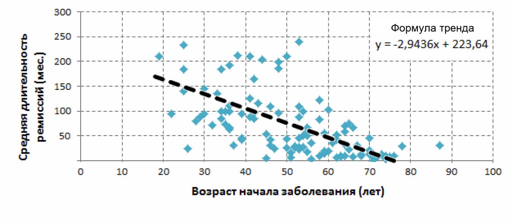
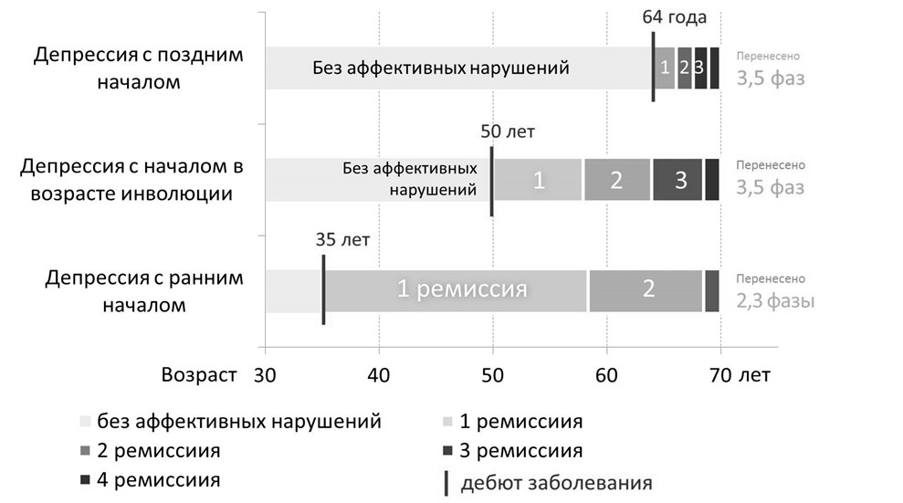

# Клинико-динамическая характеристика рекуррентного депрессивного расстройства в позднем возрасте

Автор: Захарченко Денис Валерьевич

Специальность: 14.01.06 – психиатрия

Автореферат диссертации на соискание ученой степени кандидата медицинских наук

Город Санкт-Петербург, 2015 год

Работа выполнена в ФГБУ Санкт-Петербургский научно-исследовательский психоневрологический институт им. В.М. Бехтерева

Научный руководитель: доктор медицинских наук, профессор Незнанов Николай Григорьевич

Официальные оппоненты:

- Петрова Наталия Николаевна, доктор медицинских наук, профессор, заведующая кафедрой психиатрии и наркологии Санкт-Петербургского государственного университета,

- Бабин Сергей Михайлович, доктор медицинских, наук, профессор, заведующий кафедрой психотерапии и сексологии Северо-Западного государственного медицинского университета им. И.И. Мечникова

Ведущая организация: ГБОУ ВПО Санкт-Петербургский государственный педиатрический медицинский университет

Защита состоится 26 марта 2015 года в 14 часов 00 минут на заседании совета Д 208.093.01 по защите докторских и кандидатских диссертаций при Санкт-Петербургском научно-исследовательском психоневрологическом институте им. В.М. Бехтерева (192019, Санкт-Петербург, ул. Бехтерева, д. 3)

С диссертацией можно ознакомиться в библиотеке института и на сайте института по адресу: <http://bekhterev.ru>

Автореферат разослан 26 февраля 2015 г.

Ученый секретарь диссертационного совета доктор медицинских наук, профессор Чехлатый Евгений Иванович

## ОБЩАЯ ХАРАКТЕРИСТИКА РАБОТЫ

**_Актуальность исследования._** Проблема депрессий пожилых людей с каждым годом приобретает все большее значение. Это связано как с более высокой, чем у лиц молодого возраста, распространенностью депрессивных расстройств у индивидуумов, находящихся в инволюционном периоде (Kanowski S., 1994; Kessler R.C., 2010), так и с тенденцией к увеличению доли пожилых в обществе (Lutz W., 2008). Было показано, что в пожилом возрасте существует ряд факторов, предрасполагающих к появлению депрессий, однако вклад каждого из них в развитие аффективной патологии остается предметом дискуссий (Смулевич А.Б., 2001; Круглов Л.С., 2011; Незнанов Н.Г., 2012; Alexopolos G.S., 2009; Wilkins V.M., 2010). В этом ряду рассматривалось снижение качества жизни пожилых людей, обусловленное не только уменьшением их материального достатка в связи выходом на пенсию и снижением денежного обеспечения, но и утяжелением течения в этом возрастном периоде имеющихся соматических заболеваний, что в целом способствует повышению уровня суицидоопасности (Alexopoulos G.S., 2005; Blazer D.G., 2009).

Проведенные ранее исследования обнаружили специфичность психопатологической структуры депрессии у лиц пожилого возраста и особенности ее динамики в процессе старения организма (Ефименко М.Л., 1975; Штернберг Э.Я., 1977; Вертоградова О.П., 1986; Концевой В.А., 1997), однако их результаты оказались во многом противоречивыми. Так, большинство исследований показали прогностически неблагоприятные особенности депрессий и их динамики в позднем возрасте: учащение, утяжеление и атипичность фазных колебаний, преобладание тревожного аффекта, присоединение бредовых расстройств и интеллектуального снижения, высокая коморбидность с соматическими заболеваниями (Ефименко В.Л., 1975; Минеев А.Н., 1983). Вместе с тем, другие авторы отмечали, что в ряде случаев особенности и динамика депрессий позднего возраста характеризуются снижением амплитуды колебаний фона настроения, упрощением и типизацией синдромальных проявлений, возрастанием удельного веса неразвернутых состояний и преобладанием аффективных нарушений невротического уровня (Сударева Л.О.,1983; Вертоградова О.П., 1986; Воробьева О.В., 2004).

Актуальным вопросом психиатрии является типизация депрессий, как в целом, так и в частности – в позднем возрасте. В настоящий момент не существует общей классификации депрессивных расстройств, а имеются лишь различные способы разделения депрессий на подтипы, в рамках которых в качестве системообразующих акцентируются то одни, то другие признаки (Петрова Н.Н., 1996; Тиганов А.С., 1999; Смулевич А.Б., 2013; Harald B., 2012), что затрудняет возможность сравнения между собой результатов различных исследований.

Также неоднозначной остается оценка возможностей антидепрессивной терапии в геронтопсихиатрической практике. Многочисленные исследования, сравнивавшие эффективность лечения депрессий у больных пожилого и среднего возраста, не позволили прийти к единой точке зрения относительно выраженности различий терапевтических подходов между этими группами, так как результаты этих работ значительно различались у разных исследователей (Бабин С.М., 1996; Андрусенко М.П., 2004; Hughes D.C., 1993; Fischer L.R., 2003). При этом в большинстве исследований сравнивался только ответ на терапию пациентов пожилого и среднего возраста, без учета влияния клинической картины и особенностей характера течения рекуррентного аффективного заболевания.

Таким образом, имеющиеся расхождение в оценках поздневозрастной депрессии свидетельствует о недостаточной изученности этого вида патологии. Наличие значительных противоречий приводит к необходимости проведения комплексного анализа течения рекуррентного депрессивного расстройства, с оценкой взаимосвязей между различными компонентами психопатологических нарушений, динамики синдромальных проявлений и характера ответа на лечение. Проведение такого анализа позволит приблизиться к ответу на вопрос, что представляет собой рекуррентная депрессия позднего возраста, какие факторы определяют ее течение и какие из них могут влиять на эффективность антидепрессивной терапии.

В связи с вышесказанным были выделены основная цель и задачи настоящего исследования.

Цель исследования: повысить возможность своевременного выявления рекуррентного депрессивного расстройства у пожилых и уточнить особенности его клиники и терапии на различных этапах течения заболевания

### Задачи исследования

1. Исследовать клинико-динамические характеристики рекуррентного депрессивного расстройства у пожилых пациентов: клинические особенности психопатологических проявлений (с учетом различия соотношений их структурных компонентов), характер течения (с учетом длительности и частоты фаз), качество ремиссий.
2. Определить основные факторы, влияющие на характер течения поздневозрастных депрессий.
3. Оценить характер соматической отягощенности и уровень нейротизма у пациентов с депрессией в позднем возрасте.
4. Изучить эффективность антидепрессивной терапии на различных этапах течения рекуррентной депрессии.

**_Научная новизна_**. Впервые была выполнена комплексная оценка течения рекуррентных депрессий у лиц пожилого возраста, заболевших в разные периоды жизни.

Дана характеристика клинической симптоматики поздневозрастных депрессий на разных этапах течения заболевания, получены уточняющие данные о высоком уровне нейротизма и сопутствующей соматической патологии у пациентов исследуемой группы.

Впервые на примере российской популяции рекуррентное депрессивное расстройство было рассмотрено на всем протяжении заболевания. Прослежены учащение и утяжеление депрессивных фаз без изменения их длительности, сокращение и ухудшение качества ремиссий, изменения синдромальных проявлений аффективного расстройства, связь обострений с различными внешними факторами, а также оценена динамика получаемой пациентами психофармакотерапии в позднем возрасте.

Проведена типизация клинических проявлений депрессии и показана взаимосвязь динамики аффективной симптоматики с возрастом ее начала – фактором, ранее практически не рассматриваемым в работах отечественных авторов. Впервые показано, что пациенты, заболевшие в разные возрастные периоды, значимо различаются по продолжительности ремиссий, общей тяжести и структуре депрессивного синдрома, степени влияния внешних факторов на частоту обострений и по характеру ответа на антидепрессивную терапию.

Обнаружено, что различия в проявлениях депрессивной симптоматики у больных, заболевших в разные возрастные периоды, уменьшаются по мере достижения пациентами пожилого возраста.

Были подробно изучены соотношения особенностей субъективных переживаний состояния депрессии в пожилом возрасте с ее объективно наблюдаемыми признаками, а также отражен высокий уровень осознания пациентами своего аффективного заболевания.

### Практическая значимость работы. По результатам исследования выделены признаки, позволяющие прогнозировать характер дальнейшего течения аффективного заболевания и эффективность антидепрессивной терапии у пациентов, страдающих рекуррентной депрессией в пожилом возрасте

Обнаружено, что характер течения аффективного расстройства, его клинические проявления и степень ответа на антидепрессивную терапию связаны с длительностью заболевания и возрастом дебюта депрессивной симптоматики. Выявлено, что депрессия с поздним началом является наиболее неблагоприятным типом поздневозрастной депрессии и характеризуется тенденцией к затяжному течению, короткими неполными ремиссиями, а также относительно низким ответом на фармакотерапию. Напротив, депрессия с ранним началом (до 45 лет) является относительно благоприятной в плане общего прогноза заболевания, а депрессия с началом в возрасте инволюции (45–55 лет) – в отношении лучшего ответа на терапию антидепрессантами. Учет этих данных может быть полезен для планирования фармакотерапии и оценки прогноза заболевания у пожилых пациентов с депрессией.

### Основные положения, выносимые на защиту

1. **Депрессии в позднем возрасте в целом характеризуются неблагоприятным течением, увеличением частоты и тяжести депрессивных эпизодов, сокращением длительности и ухудшением качества ремиссий.**
2. **Возраст дебюта депрессии является существенным диагностическим фактором, влияющим на ее клиническую картину и особенности рецидивирования. Увеличение возраста начала аффективного заболевания ухудшает его течение и делает прогноз более неблагоприятным.**
3. Среди пожилых пациентов с рекуррентным депрессивным расстройством можно выделить три основные группы (депрессия с ранним началом, поздним началом и началом в возрасте инволюции), отличающиеся по характеру течения аффективного заболевания и его клиническим проявлениям, но не отличающиеся по поло-возрастному составу, индивидуально-типологическим особенностям и уровню сопутствующей соматической патологии.
4. При начале депрессии в возрасте инволюции (45–55 лет) пациенты характеризовались лучшим, чем больные с началом психического расстройства вне этого временнóго периода, ответом на антидепрессивную терапию на последующих этапах заболевания.

### Апробация и внедрение результатов исследования.

По теме диссертации опубликовано 14 работ в специализированных научных изданиях, из них 4 работы в изданиях, рекомендованных ВАК для публикации материалов кандидатских диссертаций. Результаты работы доложены на Санкт-Петербургской научно-практической Школе молодых ученых в рамках цикла «Бехтеревские чтения» (2010, 2012), Научно-практической конференции к 110-летию кафедры психиатрии и наркологии Санкт-Петербургского государственного медицинского университета имени академика И.П. Павлова (2010), Второй всероссийской конференции с международным участием «Когнитивные и другие нервно-психические расстройства» (2011), Всероссийской юбилейной научно-практической конференции «Актуальные проблемы военной психиатрии» (2011), Всероссийской научно-практической конференции с международным участием «Трансляционная медицина – инновационный путь развития современной психиатрии» (2013), Международном конгрессе «Ментальное здоровье в России и Германии» (2014). Работа награждена поощрительной премией на Российской научной конференции с международным участием «Психиатрия: дороги к мастерству» (2013). Результаты работы были внедрены в работу отделения гериатрической психиатрии НИПНИ им. В.М. Бехтерева и в образовательную программу учебного центра

### Объем и структура работы.

Материал диссертации изложен на 239 страницах машинописного текста. Работа содержит введение, пять глав, выводы, список литературы. Диссертация иллюстрирована 44 таблицами и 32 диаграммами. Список литературы включает 483 наименований, в том числе 116 отечественных и 367 зарубежных источников

## Содержание работы

### Материал и методы исследования.

В исследование, проводившееся в отделении гериатрической психиатрии ФГБУ СПБ НИПНИ им. В.М. Бехтерева, методом сплошного набора было включено 110 пациентов обоего пола, обратившихся за стационарной или амбулаторной помощью

_Критериями включения_ в группу испытуемых служили следующие признаки:

1. Возраст старше 50 лет.
2. Соответствие клинического состояния и течения заболевания критериям диагноза «Рекуррентное депрессивное расстройство» (F33) МКБ-10 (ВОЗ, 1994).
3. Не менее двух депрессивных фаз в анамнезе.

_Критериями исключения_ из исследования служили следующие признаки:

1. Наличие критериев иных коморбидных психических расстройств.
2. Злоупотребление психоактивными веществами и алкоголем.
3. Тяжелая соматическая патология в стадии декомпенсации.
4. Коморбидная депрессии деменция.

В состав выборки из 110 пациентов вошли 9 мужчин (8,2%) и 101 женщина (91,8%), из них 103 человека (83,6% обследованных) были госпитализированы в отделение гериатрической психиатрии НИПНИ им. В.М. Бехтерева. Средний возраст испытуемых составил 70,2 ± 8,0 лет. Средний период врачебного наблюдения в текущей депрессивной фазе составил 5,0 ± 2,0 недели.

Основными методами исследования были клинический и психологический. Диагностика психических заболеваний производилась на основе тщательной клинико-психопатологической оценки состояния больного с учетом наследственности, индивидуального развития, перенесенных ранее заболеваний, преморбидных особенностей личности, первых проявлений и последующей динамики психических нарушений. Для диагностической верификации сопутствующих соматоневрологических заболеваний были привлечены специалисты соответствующих профилей, а также использованы вспомогательные параклинические (инструментальные и лабораторные) методы.

Оценку типа депрессии проводили на основании клинических данных с учетом показателей шкалы Гамильтона. В зависимости от характера аффективной патологии, определяющей клиническое состояние больного, имеющиеся расстройства относили к тоскливой, тревожной, апатической, астенической депрессии либо к депрессии с симптомами деперсонализации.

Для изучения структуры и динамики депрессивных нарушений, а также для исследования субъективного восприятия депрессии лицами пожилого возраста (как в рамках текущего депрессивного эпизода, так и в динамике заболевания), было разработано полуструктурированное диагностическое интервью. Результаты опроса были отражены в специально разработанной «Карте обследования больного» (Приложение), которая содержит 247 признаков, объединенных в 10 блоков.

Для объективизации полученных в ходе интервью сведений были использованы медицинские документы: истории болезней, амбулаторные поликлинические карты, выписные эпикризы из психиатрических больниц, медицинские сведения из соматических стационаров и заключения по результатам обследований из других диагностических центров.

Осмотр больного проводился дважды: первый раз при поступлении, а второй раз – спустя 5-7 недель применения антидепрессивной терапии в адекватных состоянию дозах, то есть на этапе становления ремиссии. Для более полной характеристики текущего эпизода у больных с затяжными фазами был также исследован доступный катамнестический период.

Для объективной оценки степени тяжести депрессивного состояния использовалась шкала депрессии Гамильтона (Hamilton M., 1960) (HAM-D21, 21 пункт), дополнительно для самооценки тяжести депрессии применялась шкала депрессии Бека (Beck Depression Inventory, 21 пункт) (Beck A.T., 1960). В качестве скринингового инструмента обследования состояния когнитивных функций использовалась «Краткая шкала оценки психического статуса» (Mini-mental State Examination, MMSE) и тест рисования часов (Folstein M.F., 1975; Lovenstone S., 2001). С целью оценки некоторых черт характера, способных влиять на развитие и динамику депрессий, был применен личностный опросник Айзенка (Eysenck Personality Inventory, ЕРI) (Eysenck H.J., 1963). Для оценки субъективного восприятия депрессии дополнительно использовался опрос в соответствии со списком депрессивных симптомов (Приложение).

**Статистический анализ данных** был выполнен с использованием программы IBM SPSS Statistics 20.0 – компьютерной программы статистической обработки, предназначенной для проведения прикладных исследований в социальных и медицинских науках.

На первом этапе был выполнена статистическая оценка данных всего пула больных. Вычислялись средние значения показателей (М) и их стандартные отклонения (DS), а также частотное распределение. Анализ взаимосвязи между признаками выполнялся с использованием корреляционного анализа Пирсона (Pearson K.,1900).

Для выделения групп больных был проведен кластерный анализ методом k-средних (MacQueen J., 1967), широко применяемый в медицине при большом количестве переменных и нескольких вариантах построения классификации изучаемых явлений (Леонов В.П., 1997). После этого весь пул больных был заново проанализирован с учетом полученных групп. Достоверность различий между группами (p) для выборок с нормальным распределением и гомогенностью дисперсий рассчитывалась на основе t-критерия Стьюдента. Переменные, принадлежащие к интервальной или порядковой шкалам с распределением отличным от нормального или гетерогенностью дисперсий, сравнивались с помощью непараметрических методов (U-тест Манна и Уитни, метод Краскела-Уоллиса, для расчета значения (p) – двусторонней асимптотической значимости). Вычисление различий долей (процентов) производилось по φ критерию углового преобразования Фишера. Распределения показателей сравнивались с помощью критерия χ2 Пирсона.

### ОСНОВНЫЕ РЕЗУЛЬТАТЫ ИССЛЕДОВАНИЯ

**Общая характеристика рекуррентного депрессивного расстройства.** Анализ течения рекуррентного депрессивного расстройства в общей выборке показал, что начало заболевания приходится в среднем на возраст в 51 год, средняя длительность заболевания составила 18,4 ± 14,1 лет, в течение которых больные перенесли в среднем 3,3 ± 2,4 депрессивных фазы, примерно одинаковой длительности. Средняя длительность гипотимных эпизодов составила 6,3 ± 5,7 месяцев, что может говорить о тенденции к затяжному течению депрессии, а продолжительность ремиссий – 72,7 ± 70,6 месяцев, или около 6 лет. Число госпитализаций в психиатрический стационар составило в среднем 2,0 ± 2,1 за период заболевания, необходимость в стационарном лечении возникала приблизительно в половине перенесенных эпизодов.

В целом исследуемая выборка характеризовалась преобладанием лиц женского пола (91,8%, 101 чел.), значительной отягощенностью сопутствующей соматической патологией (4,3 ± 1,1 балла по индексу коморбидности Чарлсона) и высоким уровнем нейротизма (15,4 ± 4,2 балла по шкале нейротизма в личностном тесте Айзенка). Наследственная отягощенность психическими заболеваниями отмечалась у четверти испытуемых (25,5%, 28 чел.), сезонная зависимость обострений – у половины (56,4%, 62 пациентов).

Для большинства больных была характерна умеренно выраженная тяжесть депрессии (68,2%, 75 чел.), реже отмечалась депрессия легкой (12,7%, 14 чел.) или тяжелой (19,1%, 21 чел.) степени. Менее чем в трети перенесенных фаз выявлялись когнитивные нарушения (21,6%, 103 фазы) или апатия (28,7%, 137 фаз). Как правило, ведущим в структуре синдрома был тревожный (48,2%, 53 чел.) или тревожно-тоскливый компонент (33,6%, 37 чел.). Расстройства сна и аппетита, изменения веса наблюдались в той или другой степени почти во всех случаях поздневозрастых депрессий. У части больных проявление депрессивного синдрома было редуцированным и характеризовалось наличием лишь отдельных признаков.

Течение депрессий позднего возраста было в целом неблагоприятным. Это проявлялось в том, что с течением времени у пациентов отмечалось учащение фаз (64%, 70 чел.), увеличение их тяжести (47%, 52 чел.) и появление новых (дополнительных) симптомов. По мере течения заболевания в структуре депрессивного синдрома возрастала частота представленности когнитивных симптомов (в 2,3 раза), ипохондрических переживаний (на 35%), апатии (на 30%), нарушений сна (на 26%) и аппетита (на 29%), утомляемости (на 15%), суточных колебаний настроения (на 18%). Происходило сокращение продолжительности ремиссий (с 101,1 ± 119,5 месяцев в первой ремиссии до 55,3 ± 87,7 – в последней), а также увеличивалась доля неполных ремиссий (с 45% до 66%), остаточная симптоматика которых была представлена преимущественно эпизодами гипотимии.

Было обнаружено, что между возрастом начала заболевания и длительность ремиссии существует достоверная обратная корреляция (R = ‑0,632, p < 0,01). Более позднее начало аффективного расстройства было связано с укорочением средней длительности ремиссий и делало его течение относительно менее благоприятным (рисунок 1). При этом в подавляющем числе случаев первая ремиссия у этих пациентов по сравнению с последующими была наиболее продолжительной и составляла в среднем около 9 лет (101,1 ± 119,5 мес.).

Рисунок 1 – Корреляционная связь между возрастом начала заболевания и средней продолжительностью ремиссии.

Анализ фармакотерапии показал, что в большинстве наблюдений терапия антидепрессантами приводила к полной (в 53% случаев) или частичной (в 41% случаев) ремиссии, в четверти случаев (27%) возникала необходимость в смене препарата. Нелеченые эпизоды (10,5% от всех перенесенных фаз) преимущественно приходились на дебют заболевания. В текущем эпизоде пациенты с депрессией позднего возраста также продемонстрировали удовлетворительные результаты лечения, 69,7% (69 чел.) достигли полной ремиссии, при этом необходимость смены препарата возникала в 57,3% (63 чел.). Нужно отметить, что общая эффективность психофармакотерапии в пожилом возрасте незначительно отличалась от результатов лечения в более молодом возрасте, однако для достижения ремиссии требовалась более частая смена антидепрессанта. Нам не удалось найти подтверждений предположению о возможном влиянии сопутствующей соматической терапии на провокацию депрессивной симптоматики (Dhondt A.D.F., 1995). Также мы не смогли обнаружить каких-то существенных связей между эффективностью антидепрессивной терапии и отдельными клиническими проявлениями депрессии.

**Результаты исследования после проведения кластерного анализа**. Типологизация депрессивных состояний в пожилом возрасте представляет собой отдельную проблему (Корнетов Н.А., 1999; Blazer D.G., 2003). В настоящий момент имеются различные способы разделения депрессий на подтипы, согласно которым выделяются те или иные признаки в качестве системообразующих, однако единого подхода к решению этой задачи пока не выработано (Тиганов А.С., 1997). Чтобы избежать субъективного влияния на решение этой задачи мы использовали статистический метод кластерного анализа, который является одним из возможных способов создания автоматической классификации и разделения пациентов выборки на определенные группы (Леонов В.П., 1997; Сидоренко Е.В., 2007).

В результате применения кластерного анализа к общему пулу данных, испытуемые разделились на три группы (кластера). Основными факторами, вокруг которых сформировались кластеры, стали возраст начала заболевания и длительность ремиссии. В связи с этим полученные группы были названы: «депрессия с ранним началом», «депрессия с началом в периоде инволюции» и «депрессия с поздним началом» (таблица 1). Выбирая название для групп, мы ориентировались на классификацию периодов старения по Э.Я. Штернбергу (1967), которая лучше отражает клиническую специфику психических заболеваний позднего возраста, чем более общая классификация периодов старения ВОЗ (1963).

Дальнейший статистический анализ показал значительные различия между сравниваемыми группами в характере течения, клинических проявлениях и эффективности фармакотерапии депрессивной симптоматики. При этом сравниваемые группы не отличались по полу, возрасту, выраженности сопутствующей соматической патологией или уровню нейротизма.

Таблица 11 – Основные характеристики групп

| Условное  обозначение  группы                                 | Депрессия с  поздним началом | Депрессия с началом в периоде инволюции | Депрессия с ранним началом   |
| ------------------------------------------------------------------------- | ---------------------------------- | --------------------------------------- | ---------------------------- |
| Номер кластера                                                            | 1                                  | 2                                       | 3                            |
| Средний возраст начала заболевания                                        | 64 года                            | 50 лет                                  | 35 лет                       |
| Количество пациентов и их доля                                            | 29 чел. (26,4%)                    | 63 чел. (57,2%)                         | 18 чел. (16,4%)              |
| Период, на который пришлось начало заболевания (по Штернбергу Э.Я., 1967) | Поздний  (после 55 лет)      | Инволюционный (45–55 лет)               | Средний  (до 45 лет)   |
| Длительность  заболевания                                           | Короткая  (7 лет)            | Средняя  (19 лет)                 | Длительная  (35 лет)   |
| Длительность  интермиссий                                           | Короткие  (14 мес.)          | Средние  (62 мес.)                | Длительные  (206 мес.) |
| Количество  перенесенных фаз                                        | 3,6 фаз                            | 3,6 фаз                                 | 2,3 фазы                     |
| Частота обострений                                                        | Относительно  высокая        | Относительно высокая                    | Относительно низкая          |
| Характер течения                                                          | Относительно неблагоприятный       | Умеренный                               | Относительно благоприятный   |

Пациенты с началом депрессии в среднем возрасте («раннее начало») имели более «эндогенный» характер заболевания, представленный преимущественно тоскливым аффектом и витальными нарушениями. Течение заболевания в этой группе характеризовалось относительно редкими депрессивными эпизодами по типу «клише», между которыми наблюдались наиболее продолжительные ремиссии (рисунок 2). Первые эпизоды в среднем возрасте у этих пациентов, как правило, возникали самопроизвольно (67,0%, 12 чел.), а обострение депрессии в пожилом возрасте были чаще связаны с внешними, преимущественно психотравмирующими факторами (55,6%, 10 чел.).

Пациенты с началом депрессии в позднем возрасте характеризовались частыми обострениями психического заболевания, короткими промежутками между фазами и склонностью к формированию неполных ремиссий. Первый эпизод депрессии у пожилых, как правило, возникал в связи с психотравмирующей ситуацией (65,5%, 19 чел.) и был наиболее продолжительным (11,4 ± 14,1 мес.) как по сравнению с последующими эпизодами, так и по сравнению с длительностью эпизодов у пациентов других групп. В дальнейшем на фоне высокой частоты фазообразования эпизоды депрессии все чаще рецидивировали самопроизвольно и становились короче (рисунок 2). В структуре депрессивного синдрома тревожный и тоскливый аффект встречались примерно в равных пропорциях, в некоторых случаях отмечалось преобладание апатии (14,5%, 19 фаз). В этой группе достоверно чаще встречались ипохондрические (61%, 79 фаз), сенестопатические (31%, 40 фаз) и когнитивные нарушения (30%, 39 фаз).

Наиболее интересной оказалась группа с началом депрессии в возрасте инволюции, на долю которой пришлось более половины пациентов общей выборки (таблица 1). Демонстрируя средние показатели относительно продолжительности ремиссий и частоты обострений (рисунок 2), такие пациенты значительно отличались от других групп в клиническом плане. Так, в структуре депрессивного синдрома в этой группе доминировал аффект тревоги (55,9%, 160 фаз), а представленность собственно депрессивных и витальных нарушений была значительно меньше, в связи с чем в начале заболевания наблюдались преимущественно легкие депрессии. В дальнейшем выраженность аффективной симптоматики в этой группе увеличивалась, а ведущий аффект менялся с тревожного на тревожно-тоскливый.

Рисунок 2 – Сравнительная динамика продолжительности ремиссий.

Анализ психофармакологического лечения текущего эпизода показал, что пациенты с началом аффективного заболевания в возрасте инволюции лучше реагируют на антидепрессивную терапию, чем больные с ранним или поздним началом депрессивного расстройства (таблица 2). Несмотря на одинаковую тяжесть депрессии во всех сравниваемых группах при поступлении, после проведенного лечения у части больных с ранним началом депрессии (53%, 10 чел.) сохранялась субдепресивная симптоматика. Однако наихудшие результаты лечения наблюдались в группе пациентов с поздним началом депрессии, где, наряду с сохранявшейся гипотимией (65%, 19 чел.), отмечались стойкие сенестопатии (31%, 8 чел.), эмоциональная лабильность (31%, 8 чел.), а также признаки когнитивных нарушений (42%, 11 чел.). При этом необходимо отметить, что субъективная оценка больными выраженности собственных аффективных нарушений была достаточно точной и в целом не отличалась от клинической картины, описываемой врачом.

Таблица 2 – Показатели шкалы депрессии Гамильтона при поступлении и выписке

| Показатели               | 1 Депрессия с поздним началом | 2 Депрессия с началом в периоде инволюции | 3 Депрессия с ранним началом |
| ------------------------ | ----------------------------- | ----------------------------------------- | ---------------------------- |
| Поступление (N / M ± SD) | 29 / 22,1 ± 5,3               | 63 / 21,7 ± 5,9                           | 18 / 25,4 ± 7,3              |
| Выписка\* (N / M ± SD)   | 26 / 6,5 ± 3,6\*              | 57 / 5,1 ± 4,7\*                          | 17 / 6,6 ± 4,8               |

_Примечание: \* – различия достоверны (р < 0,05)._

Таким образом, проведенное исследование позволило констатировать, что рекуррентная депрессии в позднем возрасте характеризуются неблагоприятным течением заболевания. Было обнаружено, что характер течения аффективного расстройства, его клинические проявления и степень ответа на антидепрессивную терапию во многом связаны с возрастом начала заболевания. Наиболее неблагоприятным типом является депрессия с поздним началом (после 55 лет), где наблюдается высокая частота фазообразования, склонность к затяжному течению, короткие неполные ремиссии, а также относительно низкий ответ на фармакотерапию. Напротив, депрессия с ранним началом (до 45 лет) является относительно благоприятной в плане общего прогноза заболевания, а депрессия с началом в возрасте инволюции (45–55 лет) – в отношении результатов лечения антидепрессантами. Возможно, влияние начинающихся инволюционных процессов, обусловливающих напряженную перестройку в этом возрастном периоде адаптационно-компенсаторных возможностей индивидуума, в возрасте 45–55 лет создает предпосылки для развития более частых, но при этом менее тяжелых депрессий. Учет этих данных может быть полезен для дальнейшего изучения аффективной патологии, планирования фармакотерапии, а также оценке прогноза заболевания у пожилых пациентов с депрессией.

# Выводы

1. В каждом четвертом случае обследованные больные ранее, несмотря на развитие у них депрессивной симптоматики, не получали терапии антидепрессантами, что было обусловлено недостаточностью имеющихся в настоящее время критериев для диагностики такого рода расстройств у пациентов, находящихся в поздневозрастном периоде.
2. Разработанные критерии диагностики такого рода расстройств позволили выделить из общего пула депрессивных пациентов позднего возраста три основные группы, отличающиеся по характеру течения аффективного заболевания и его клиническим проявлениям, но не отличающиеся по поло-возрастному составу, индивидуально-типологическим свойствам личности и уровню сопутствующей соматической патологии.
3. Дебют рекуррентной депрессии у обследованных больных наиболее часто (в 2/3 случаев) возникал после достижения индивидуумом 45 лет (не случайно средний возраст начала заболевания – 51 год), что свидетельствует о «привязанности» этого заболевания к более позднему возрасту. Это обстоятельство находит дополнительное подтверждение в параллельно обнаруживаемых характерных для пожилых и старых людей высоких показателей соматической отягощенности и уровня нейротизма.
4. Наиболее характерной чертой течения рекуррентной депрессии у сравниваемых групп пациентов в целом являлась тенденция к учащению и утяжелению фаз без изменения их длительности. Утяжеление клинической картины депрессий проявлялось, прежде всего, в увеличении частоты встречаемости нарушений сна и аппетита, апатии, признаков когнитивных нарушений, повышенной утомляемости и переживаний ипохондрического характера.
5. Развитие рекуррентного аффективного заболевания у обследованных больных в определенной степени было детерминировано: а) у пожилых пациентов (начало заболевания после 55 лет) – психотравмирующими ситуациями; б) у инволюционных пациентов (с началом заболевания в диапазоне 45–55 лет) – напряжением адаптационно-компенсаторных механизмов, обусловленным периодом инволюционной перестройки организма, при этом провоцирующая роль психотравмирующих факторов в формировании рецидивов заболевания становилась явственной и возрастающей лишь при дальнейшем его течении; в) у пациентов с относительно ранним началом заболевания (до 45 лет) – преимущественно эндогенными факторами, которые оказывались доминирующими и при последующей динамике психического расстройства.
6. Для больных с ранним началом депрессии характерна мало зависящая от длительности заболевания синдромальная клишированность фаз, возникающих в процессе динамики заболевания при рецидивах психического состояния пациентов и характеризующихся преобладанием тоскливого аффекта. Для пациентов с началом депрессии в периоде инволюции было характерным преобладание в структуре аффективных фаз тревожно-тоскливых симптомокомплексов с относительно неглубоким уровнем представленности психопатологических нарушений в дебюте заболевания и последующим заметным утяжелением аффективной симптоматики. Для пациентов с поздним началом характерно более частое развитие в структуре аффективных фаз апатической депрессии, равная представленность тоски и тревоги, а также умеренные темпы утяжеления клинической картины.
7. Различия в течении рекуррентного аффективного заболевания в поздневозрастном периоде были связаны преимущественно с возрастом начала заболевания. Для раннего начала депрессии (до 45 лет) характерны наиболее редкие обострения и длительные ремиссии, и, наоборот, для группы больных с поздним началом депрессии (после 55 лет) характерны наиболее частые обострения и короткие ремиссии. Группа с началом депрессии в периоде инволюции (45–55 лет) занимает по этим показателям промежуточное положение.
8. По мере развития заболевания для всей группы пациентов с рекуррентной депрессией в пожилом возрасте было характерно прогрессивное снижение длительности и качества ремиссий, категориально относимые к симптоматическим ее вариантам. При этом наиболее частой остаточной симптоматикой в ремиссии являлась аффективная неустойчивость.
9. Эффективность проводимой антидепрессивной терапии у пациентов, развитие заболевания которых связано с поздним (после 55 лет) или более ранним (до 45 лет) возрастом, значимо не различалась. В отличие от этого, у пациентов с началом депрессии в периоде инволюции (45–55 лет) отмечалась бóльшая, чем у больных двух других сравниваемых групп, редукция психопатологической симптоматики и связанных с депрессий когнитивных симптомов.

## Практические рекомендации

1\. Лица в возрасте старше 45 лет являются группой риска в отношении развития у них аффективной патологии. В том случае, если обнаруживаются отдельные редуцированные признаки депрессии, необходимо проводить тщательное клиническое обследование этих лиц, направленное на профилактику развития и становления в дальнейшем рекуррентного аффективного заболевания.

2\. Выявление у лиц пожилого и старческого возраста актуальной аффективной патологии, в том числе и скрытой (маскированной) депрессии, требует обязательного назначения антидепрессивной терапии в адекватных дозах длительностью не менее 6 месяцев.

3\. При наличии хронической соматической патологии необходимо включить в комплекс лечебный мероприятий, помимо антидепрессивной, также соответствующей соматически ориентированной терапии. При наличии различных психотравмириующих факторов необходимо дополнительное проведение психотерапевтических и/или социотерапевтических мероприятий.

4\. В связи с тем, что лица, впервые заболевшие в возрасте старше 55 лет, имеют выраженную тенденцию к частому рецидивированию, худшему ответу на терапию и формированию неполных ремиссий, чем пациенты с более ранним дебютом болезни, необходимо их амбулаторное сопровождение врачом-психиатром на протяжении длительного временного периода и динамическое поддерживающее лечение антидепрессантами.

**_Список работ, опубликованных по теме диссертации_**

## Научные статьи в журналах, входящих в перечень ВАК

1. Захарченко Д.В. Влияние семейного статуса на госпитализации психически больных позднего возраста / В.Ф. Друзь, В.Г. Будза, И.Н. Олейникова, Е.Ю. Антохин, Е.Б. Чалая, Д. В. Захарченко // Уральский медицинский журнал. – 2009. – Т. 60, № 6 – С. 123–128.
2. Захарченко Д.В. Анализ аффективных расстройств у пациентов с сосудистой деменцией / Н.Г. Незнанов, Д.В. Захарченко, Н.М. Залуцкая // Когнитивные и другие нервно-психические расстройства: специальный выпуск журнала «Неврология, нейропсихиатрия, психосоматика». – 2012. – № 2 – С. 61–65.
3. Захарченко Д.В. Клинико-динамическая характеристика рекуррентных депрессивных расстройств в позднем возрасте (к проблеме психосоматических соотношений)/ Н.Г. Незнанов, Д.В. Захарченко, Н.М. Залуцкая // Психические расстройства в общей медицине. – 2013. – № 1. – С. 4–9.
4. Захарченко Д.В. Применение тразодона в комплексном лечении пациентов старших возрастных групп, страдающих органическим депрессивным расстройством / Ю.А. Бельцева, Д.В. Захарченко, И.Г. Шабалина, Ю.Е. Зайцев // Обозрение психиатрии и медицинской психологии им. В.М. Бехтерева. – 2014. – № 1. – С. 84–89.

## Другие научные публикации

1. Захарченко Д.В. Госпитализации больных позднего возраста с депрессивными расстройствами в психиатрический стационар / В.Ф. Друзь, В.Г. Будза, Е.Ю. Антохин, И.Н. Олейникова, Е.В. Каримова, Д.В. Захарченко // Информационный архив. – 2008. – Т. 2, № 4. – С. 53–55.
2. Захарченко Д.В. Факторы риска частоты и длительности госпитализаций психически больных позднего возраста / В.Ф. Друзь, В.Г. Будза, И.Н. Олейникова, Е.Ю. Антохин, Е.Б. Чалая, Д.В. Захарченко // Научно-медицинский вестник Центрального Черноземья. – 2009. – № 35. – С. 86–94.
3. Захарченко Д.В. Роль фактора одинокого проживания в развитии депрессивных расстройств у диспансерного контингента больных позднего возраста / В.Ф. Друзь, И.Н. Олейникова, Д.В. Захарченко // Взаимодействие специалистов в оказании помощи при психических расстройствах: материалы конференции в рамках ежегодной Общероссийской конференции и пленума Правления Российского общества психиатров с участием главных психиатров и наркологов, руководителей психиатрических и наркологических учреждений субъектов Российской Федерации совместно со 2-м Восточно-Европейским Конгрессом по психиатрии. – М., 2009. – С. 343–344.
4. Захарченко Д.В. Оценка влияния факторов на частоту и длительность госпитализаций психически больных позднего возраста / Д.В. Захарченко // Материалы Санкт-Петербургской научно-практической конференции молодых ученых в рамках цикла «Бехтеревские чтения». – СПб., 2010. – С. 20–21.
5. Захарченко Д.В. Катамнестический анализ депрессий позднего возраста с последующим исходом в деменцию / Д.В. Захарченко // Материалы научно-практической конференции к 110-летию кафедры психиатрии и наркологии Санкт-Петербургского государственного медицинского университета имени академика И.П. Павлова. – СПб., 2010. – С. 65–66.
6. Захарченко Д. В. Характеристика рекуррентных депрессий в позднем возрасте / Н.Г. Незнанов, Д.В. Захарченко // Актуальные проблемы военной психиатрии: материалы Всероссийской юбилейной научно-практической конференции. – СПб., 2011. С. 177–178.
7. Захарченко Д.В. Влияние синдромальных особенностей на течение рекуррентного депрессивного расстройства в позднем возрасте / Д.В. Захарченко // Современный взгляд на проблемы психоневрологии XXI века: материалы Санкт-Петербургской научно-практической Школы молодых ученых в рамках цикла «Бехтеревские чтения». – СПб., 2012. – С. 24–25.
8. Захарченко Д.В. Личностные особенности пациентов пожилого возраста, страдающих рекуррентным депрессивным расстройством / Д.В. Захарченко // Материалы 11-й Всероссийской Общественной профессиональной медицинской психотерапевтической конференции / под ред. А.И. Аппенянского, Ю.П. Бойко, В.Н. Краснова, В.И. Курпатова, Ю.С. Шевченко. – МО, Щёлково, 2013. – С. 206–207
9. Захарченко Д. В. Особенности течения рекуррентного депрессивного расстройства в позднем возрасте / Д.В. Захарченко // Трансляционная медицина – инновационный путь развития современной психиатрии: материалы конференции / Под ред. Н.Г. Незнанова, В. Н. Краснова. – Самара, 2013. – С. 333–334.
10. Захарченко Д.В. Аффективные, когнитивные и личностные особенности пациентов пожилого возраста, страдающих рекуррентным депрессивным расстройством / Н.Г. Незнанов, Д.В.Захарченко, Н.М. Залуцкая // Ментальное здоровье в России и Германии: материалы международного конгресса. – СПб., 2014. – С. 64.

## Данные о печати:

Подписано в печать 23.01.2015. Формат 60 х 84/16.

Отпечатано с готового оригинал-макета в типографии СПб НИПНИ им В.М. Бехтерева методом оперативной полиграфии.

Заказ №26/15. Тираж 100 экз.

Типография СПб НИПНИ им В.М. Бехтерева.

192019, Санкт-Петербург, ул. Бехтерева, д. 3, тел. 670-02-19
